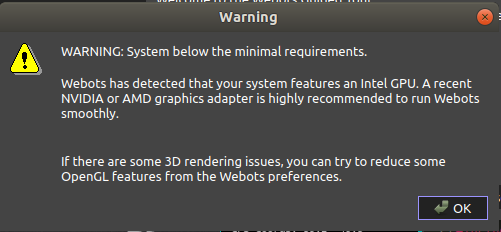
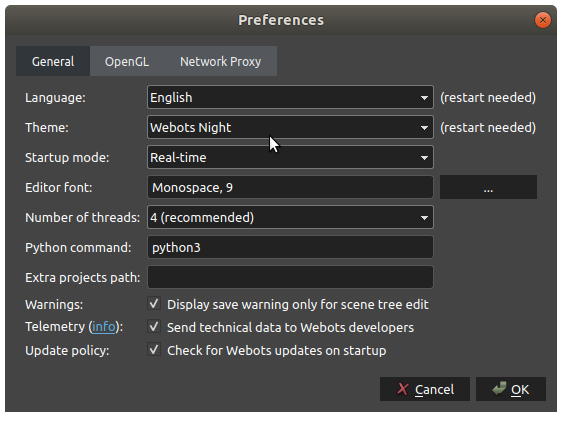
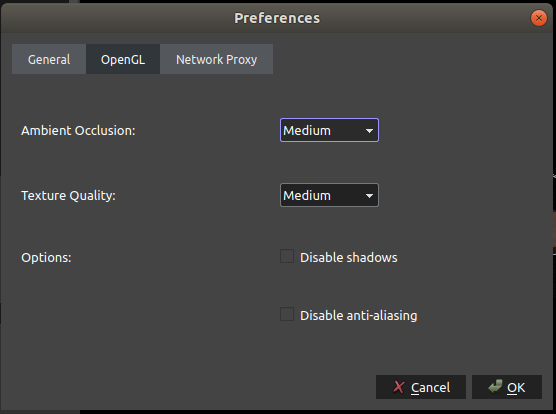
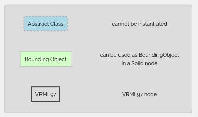
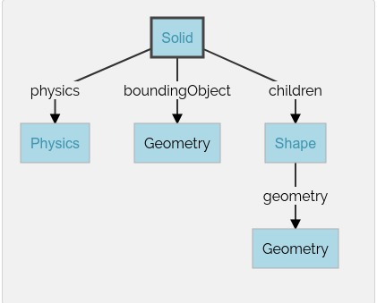
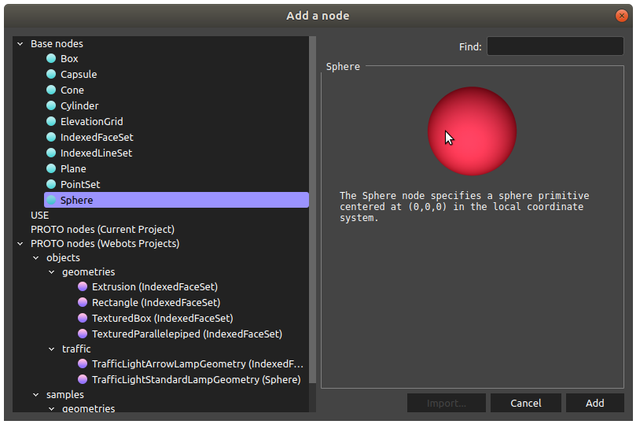
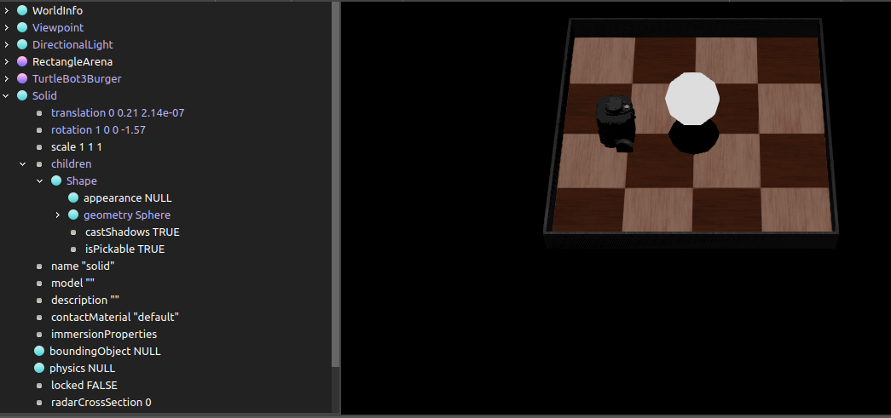
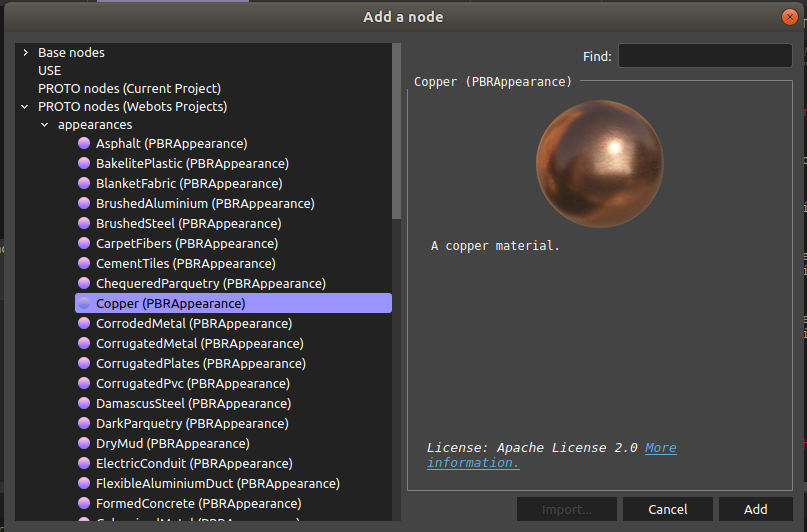
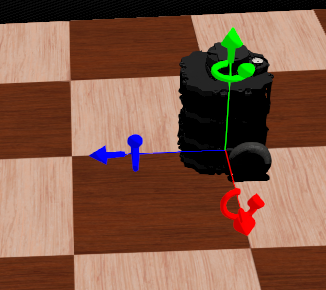

# Webots学习笔记

[toc]

## 前言

刚开始接触webots机器人仿真平台, 将自己探索的过程记录下来.


更新时间: 2020-02-16

作者: 阿凯

QQ: 244561792


## Webots的简介

> 适用对象：有想法的年轻人
>
> Webots是一个有趣的开源机器人模拟仿真器，为仿真、编程和模拟机器人、车辆和生物力学系统提供了完整的开发环境。
>
> 适合做方案、仿真验证等科学开发的工作，可能是未来机器人研发的新方向。此仿真器带有标准案例库，网上很多学习指南，方便上手，可以尝试探索。

--摘自RoboMaster


> Webots近一两年才由商业软件模式改为开源模式，Webots综合了很多Gazebo和VREP功能上的优点，因而也是我目前最推荐学习的一款软件。Webots目前最大的问题在于参考资料较少，虽然文档还算详细，但是学习曲线会比VREP更陡峭一些。我目前的项目中主要使用Webots的C++ API和ROS API，两者在“仿真代码”和“上层功能代码”关系的处理上都把握的很好，传感器数据的获取以及仿真部分代码添加外部依赖库的处理也很方便。

--摘自知乎


## Webots下载与安装

官网地址

https://www.cyberbotics.com/

软件下载地址

https://github.com/cyberbotics/webots/releases


支持编程语言: Python/C++/其他

支持操作系统: Ubuntu /  Windows

https://blog.csdn.net/bangli1024/article/details/89519220


### 安装依赖 

```bash
sudo apt install libssh-dev
```

### 软件安装

```bash
sudo dpkg -i webots_2020a-rev1_amd64.deb
```


### 启动webots

在搜索栏目里面检索`webots`

详情见`video/运行Webots.mkv`


运行的时候被提示硬件配置过低, 流下了贫穷的泪水



实际上还是可以的用的, 最多会有些卡顿, 然后就是一些渲染选项设置的低配一些.


### 窗口布局重置

窗口定制,  如果操作界面里有哪些窗口不小心关闭了,  但是不知道怎么开启. 

`Tools--> Restore Layout` 重置布局

### 首选项

`Tools--> Preference` 设置首选项




python -> python3 

因为Ubuntu的python默认是Python2,所以需要修改




显卡不够就降低一下渲染的程度.


## 导入对象

导入对象前,先暂停仿真. 按下暂停键. 要不然,没有floor的话, 加入机器人, 机器人直接就掉下去了。


选择灯光 DirectionLight

导入方形底板　floor

选择Robotis的TurtleBot作为我们的机器人模型.


操作视频演示: 

* [导入对象到场景](video/导入对象到场景.mkv)


## 创建机器人的控制器(Python)

参见视频:

* [给机器人添加Controller](./video/给机器人添加Controller.mkv)


```python
#!/usr/bin/python3
"""TurtleBurgerController controller."""
# You may need to import some classes of the controller module. Ex:
#  from controller import Robot, Motor, DistanceSensor
from controller import Robot
# create the Robot instance.
# 创建机器人
robot = Robot()
# get the time step of the current world.
# 获取时间戳
timestep = int(robot.getBasicTimeStep())
# get the motor devices
# 获取左右两侧的电机
leftMotor = robot.getMotor('left wheel motor')
rightMotor = robot.getMotor('right wheel motor')
# set the target position of the motors
# 设置电机的旋转弧度 10rad
leftMotor.setPosition(20.0)
rightMotor.setPosition(20.0)

# 机器人不停止,一直前进
# leftMotor.setPosition(float('inf'))
# rightMotor.setPosition(float('inf'))
# 设置电机的旋转速度 rad/s
leftMotor.setVelocity(2)
rightMotor.setVelocity(2)
# 主循环
while robot.step(timestep) != -1:
    pass
```


点击工具栏里面的`Reload` 重载按钮, 测试新写的Controller.


效果视频见: 

* [机器人前进一段距离](video/机器人前进一段距离.mkv)

* [机器人不停的前进](./video/机器人不停的前进.mkv)


调整初始时刻的位姿的顺序, 按下暂停键盘, 然后重置系统，让时刻停止在0

此时选中机器人, 调整机器人的初始位置. 

效果视频见: 

* [重置机器人的初始位置](./video/重置机器人的初始位置.mkv)


> TODO 有些奇怪的问题
>
> 为什么Position 设置为10就没有反应, 设置为20.0就有反应？???


## 修改环境

https://www.cyberbotics.com/doc/guide/tutorial-2-modification-of-the-environment

效果视频

* [修改对象的属性(floor)](video/修改对象的属性(floor).mkv) 调整底板的尺寸
* [调整光线的强度](./video/调整光线的强度.mkv)


## Webots里面的节点Node

> TODO 整理Webots的Node相关概念


Webots里面的机器人建模使用的是VRML语言 ?

* Group 组
* Transform 坐标
* Solid  个体
* Robot 机器人

四轮机器人的低层次表示




* `Abstract Class` 抽象类
* `Bounding Object` 可以被Solid节点用做`boudingObject`
* `VRML97` 


## Solid节点



Solid Node 代表是刚体

webots的物理引擎,只能仿真刚体

物理引擎需要指定boundingObject

children里面定义的是这个刚体的外观细节(集合形状), 内部的构成


Geometry Box 指的应该是刚体的几何包围体吧

webots参考手册-Node Chart 

https://www.cyberbotics.com/doc/reference/node-chart


### 添加一个Solid节点

操作视频

* [添加一个球体](video/添加一个球体.mkv)


Solid Node是Base Node中的一种

### 添加几何形状

在Solid的`Children`里面, 添加一个新的Shape.

设置Shape的Geometry(几何形状)与Apparence(外观)

设置几何形状(Geometry)为球体(Sphere)






### 添加渲染

设置外观渲染, 选择铜制的外观.

> TODO 什么是PBRAppearance?




完成添加之后的效果


> TODO 如何不让机器人穿过solid, 添加碰撞检测 ?


## Webots坐标系





webots的坐标系定义有些特殊.

机器人前方是Z轴, 侧方是X轴, 上方是Y轴.


> TODO 怎么修改坐标系啊？
>
> 有人知道么, 我想让Z轴朝上, X轴朝前.


## 学习博客

阿龙-webots

https://www.cnblogs.com/clliu/archive/2017/03.html


## 机器人建模


https://www.cnblogs.com/clliu/p/6538648.html


